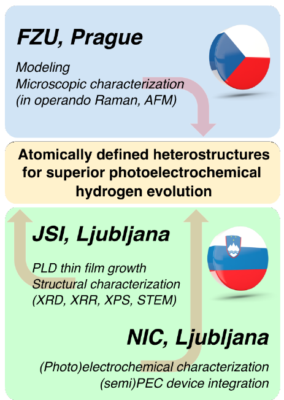

## Semiconductor – dielectric heterostructures for photoelectrochemical hydrogen evolution ##

SeDiHe, a joint Czech - Slovenian research project, focuses on photoelectrochemical (PEC) water splitting for H2 generation from heterostructures that combine a protective oxide layer (POL) with a semiconductor. We propose a radically new approach to assemble these two dissimilar material systems in order to create an atomically defined interface. The idea is based on nanostructuring using a graphene oxide (GO) layer, which should have a crucial role in van der Waals epitaxy between the constituents, as well as their electronic coupling. The heterostructures are integrated into semi-PEC reactors, where a photovoltaic (PV) cell supplies an additional external voltage to achieve H2 production.  
  
Success of this strategy requires detailed knowledge of:
<ul>
  <li>the key parameters contributing to higher efficiency of H2 generation from PEC water splitting, such as defect concentrations and atomic structure of the interface,</li>
  <li>options to engineer band offsets using various dielectric POL materials,</li>
  <li>factors limiting solar-to-hydrogen (STH) efficiency of semi-PEC reactors made of these novel heterostructures.</li>
</ul>

### Research partners
-	[Department of Dielectrics](http://palata.fzu.cz/diel/) , Institute of Physics of the Czech Academy of Sciences, Prague, Czech Republic
-	[Advanced Materials Department](http://www-k9.ijs.si/) , Jožef Stefan Institute, Ljubljana, Slovenia
-	[Laboratory for Electrocatalysis](https://www.ki.si/en/departments/d10-department-of-materials-chemistry/l10-laboratory-for-electrocatalysis/) , Department of Materials Chemistry, National Institute of Chemistry, Ljubljana, Slovenia

### Project duration: 2021-2024

### Contact
-	PI in Slovenia: Asst. Prof. Matjaž Spreitzer, matjaz.spreitzer@ijs.si
